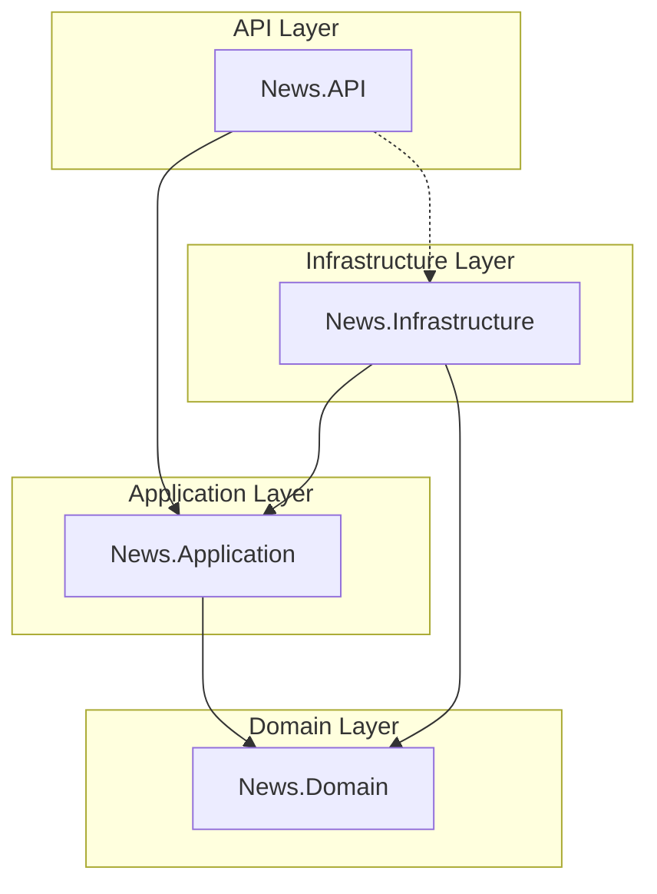

# News Management API

[](https://dotnet.microsoft.com/download/dotnet/8.0)
[](https://www.microsoft.com/en-us/sql-server/)
[](https://blog.cleancoder.com/uncle-bob/2012/08/13/the-clean-architecture.html)
[](https://martinfowler.com/bliki/CQRS.html)

---

## 📝 Giới thiệu

**News Management API** là một giải pháp RESTful API được xây dựng trên nền tảng **ASP.NET Core 8.0**, áp dụng triết lý **Clean Architecture** và mẫu thiết kế **CQRS** (Command Query Responsibility Segregation) nhằm đảm bảo tính mở rộng, dễ bảo trì và hiệu năng tối ưu.

## 🚀 Tính năng chính

- **Quản lý Menu (CRUD)**: Phân loại tin tức theo chuyên mục.
- **Quản lý Tin tức (CRUD)**: Lưu trữ và hiển thị bài viết với các bộ lọc linh hoạt.
- **Tối ưu hóa Truy vấn**: Sử dụng Dapper cho các tác vụ đọc (Read) và EF Core cho các tác vụ ghi (Write).
- **Xử lý Ngoại lệ Toàn cục (Global Exception Handling)**: Trả về phản hồi chuẩn hóa khi có lỗi xảy ra.

## 🏗️ Kiến trúc Hệ thống

Hệ thống được chia thành 4 lớp (layers) cốt lõi theo nguyên tắc **Dependency Inversion**:



- **News.API**: Cổng giao tiếp ngoại vi, quản lý Controllers, Middleware và Dependency Injection.
- **News.Application**: Chứa logic nghiệp vụ (Use Cases), DTOs, MediatR Handlers, Interfaces.
- **News.Domain**: Chứa các Entities, Value Objects và các Interface Repositories lõi.
- **News.Infrastructure**: Triển khai chi tiết các truy cập dữ liệu (EF Core Context, Repositories, Dapper Implementation).

## 🛠️ Tech Stack

| Category                | Technology              |
| ----------------------- | ----------------------- |
| **Runtime**             | .NET 8.0                |
| **Framework**           | ASP.NET Core Web API    |
| **Persistence (Write)** | Entity Framework Core 8 |
| **Persistence (Read)**  | Dapper (Micro-ORM)      |
| **Messaging**           | MediatR                 |
| **Database**            | SQL Server              |
| **Testing**             | xUnit, Moq              |

## 📐 Concepts & Design Patterns

### CQRS & Hybrid Persistence

Tôi tách biệt hoàn toàn luồng xử lý dữ liệu:

- **Commands (Write)**: Sử dụng **EF Core** để quản lý trạng thái, đảm bảo tính nhất quán (Consistency) và các ràng buộc dữ liệu phức tạp.
- **Queries (Read)**: Sử dụng **Dapper** để thực thi SQL thuần, mang lại hiệu năng tối đa và sự linh hoạt trong việc lấy dữ liệu (Projections).

### MediatR

Đóng vai trò trung gian giúp giải quyết vấn đề phụ thuộc giữa các thành phần. Mỗi Request (Command/Query) được xử lý bởi một Handler riêng biệt, giúp code tuân thủ nguyên tắc **Single Responsibility Principle (SRP)**.

## 🏁 Bắt đầu (Getting Started)

### Điều kiện tiên quyết (Prerequisites)

- [.NET 8 SDK](https://dotnet.microsoft.com/download/dotnet/8.0)
- [SQL Server](https://www.microsoft.com/en-us/sql-server/sql-server-downloads) (2019+)
- [Git](https://git-scm.com/downloads)

### Cài đặt

1. **Clone repository**:
   ```bash
   git clone <repository-url>
   cd News
   ```
2. **Khôi phục các gói (Restore packages)**:
   ```bash
   dotnet restore News.sln
   ```

### Cấu hình (Configuration)

Cập nhật chuỗi kết nối (Connection String) trong `src/News.API/appsettings.json`:

```json
"ConnectionStrings": {
  "DefaultConnection": "Server=YOUR_SERVER;Database=NewsDB;Trusted_Connection=True;TrustServerCertificate=True"
}
```

### Khởi tạo Cơ sở dữ liệu

```bash
dotnet ef database update --project src/News.Infrastructure --startup-project src/News.API
```

### Chạy ứng dụng

```bash
dotnet run --project src/News.API
```

## 🧪 Kiểm thử (Testing)

Dự án bao gồm các Unit Test cho Application và API layers:

```bash
dotnet test
```

## 📜 Tài liệu API (API Documentation)

### Định dạng Phản hồi Lỗi (Error Response)

Hệ thống sử dụng Middleware xử lý lỗi tập trung:

```json
{
  "error": "Mô tả chi tiết lỗi tại đây"
}
```

### Endpoints

#### Menu Management

- `GET /api/Menu`: Lấy tất cả menu.
- `GET /api/Menu/{id}`: Lấy chi tiết menu.
- `POST /api/Menu`: Tạo mới menu.
- `PUT /api/Menu/{id}`: Cập nhật menu.
- `DELETE /api/Menu/{id}`: Xóa menu.

#### News Management

- `GET /api/news`: Lấy danh sách tin tức (Filter: `?menuId=...`).
- `GET /api/news/{id}`: Xem chi tiết bài viết.
- `POST /api/news`: Đăng bài mới.
- `PUT /api/news/{id}`: Chỉnh sửa bài viết.
- `DELETE /api/news/{id}`: Xóa bài viết.

## 📁 Cấu trúc thư mục

```text
src/
├── News.API/              # Controllers, Middlewares, Program.cs
├── News.Application/      # CQRS Features, Handlers, DTOs, Interfaces
├── News.Domain/           # Entities (Menu, NewsList), Interfaces
└── News.Infrastructure/   # AppDbContext, Repositories, Migrations

tests/
└── News.UnitTests/        # Unit Tests cho Controllers & Business Logic
```

## 📄 Giấy phép (License)

Dự án được phân phối dưới giấy phép MIT. Xem chi tiết tại [LICENSE](LICENSE) (nếu có).
