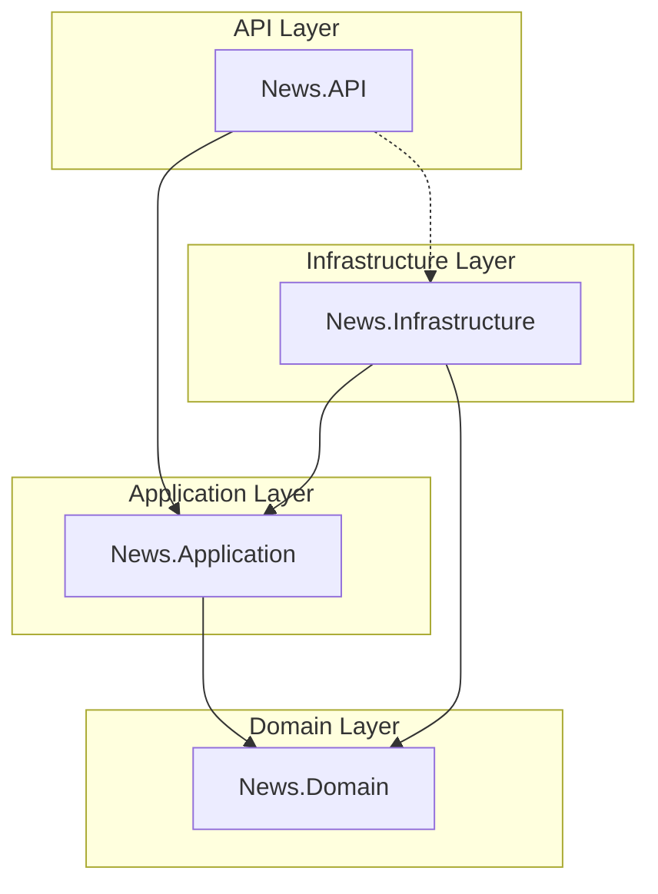

# News Management API

[](https://dotnet.microsoft.com/download/dotnet/8.0)
[](https://www.microsoft.com/en-us/sql-server/)
[](https://blog.cleancoder.com/uncle-bob/2012/08/13/the-clean-architecture.html)
[](https://martinfowler.com/bliki/CQRS.html)

---

## 📝 Giới thiệu

**News Management API** là một giải pháp RESTful API được xây dựng trên nền tảng **ASP.NET Core 8.0**, áp dụng triết lý **Clean Architecture** và mẫu thiết kế **CQRS** (Command Query Responsibility Segregation) nhằm đảm bảo tính mở rộng, dễ bảo trì và hiệu năng tối ưu.

## 🚀 Tính năng chính

- **Quản lý Menu (CRUD)**: Phân loại tin tức theo chuyên mục.
- **Quản lý Tin tức (CRUD)**: Lưu trữ và hiển thị bài viết với các bộ lọc linh hoạt.
- **Tối ưu hóa Truy vấn**: Sử dụng Dapper cho các tác vụ đọc (Read) và EF Core cho các tác vụ ghi (Write).
- **Xử lý Ngoại lệ Toàn cục (Global Exception Handling)**: Trả về phản hồi chuẩn hóa khi có lỗi xảy ra.

## 🏗️ Kiến trúc Hệ thống

Hệ thống được chia thành 4 lớp (layers) cốt lõi theo nguyên tắc **Dependency Inversion**:



- **News.API**: Cổng giao tiếp ngoại vi, quản lý Controllers, Middleware và Dependency Injection.
- **News.Application**: Chứa logic nghiệp vụ (Use Cases), DTOs, MediatR Handlers, Interfaces.
- **News.Domain**: Chứa các Entities, Value Objects và các Interface Repositories lõi.
- **News.Infrastructure**: Triển khai chi tiết các truy cập dữ liệu (EF Core Context, Repositories, Dapper Implementation).

## 🛠️ Tech Stack

| Category                | Technology              |
| ----------------------- | ----------------------- |
| **Runtime**             | .NET 8.0                |
| **Framework**           | ASP.NET Core Web API    |
| **Persistence (Write)** | Entity Framework Core 8 |
| **Persistence (Read)**  | Dapper (Micro-ORM)      |
| **Messaging**           | MediatR                 |
| **Database**            | SQL Server              |
| **Testing**             | xUnit, Moq              |

## 📐 Concepts & Design Patterns

### CQRS & Hybrid Persistence

Tôi tách biệt hoàn toàn luồng xử lý dữ liệu để tối ưu hóa hiệu năng và khả năng bảo trì:

- **Commands (Write)**: Sử dụng **Repository Pattern** kết hợp với **EF Core**.
  - Logic: Handler → Repository Interface → EF Core Implementation.
  - Mục tiêu: Đảm bảo tính nhất quán dữ liệu (Data Integrity), quản lý Transaction và các ràng buộc phức tạp thông qua Unit of Work.
- **Queries (Read)**: Sử dụng **Dapper** trực tiếp trong **Query Handlers**.
  - Logic: Handler → `IDbConnection` → Raw SQL (Dapper).
  - Mục tiêu: Đạt hiệu năng tối đa (Maximum Performance), giảm thiểu overhead của ORM và linh hoạt tối đa trong việc tạo các Projections/DTOs phức tạp mà không bị gò bó bởi các Interface Repository truyền thống.

## ⚖️ Trade-offs: Direct Dapper in Handlers vs. Repository Pattern

Dự án này lựa chọn cách tiếp cận "Hybrid" (Hỗn hợp). Dưới đây là bảng so sánh các đánh đổi (trade-offs) giữa việc dùng Dapper trực tiếp trong Handler so với việc bọc qua Repository:

| Tiêu chí           | Dapper trực tiếp trong Query Handler (Lựa chọn của dự án)                                                          | Dapper bọc qua Repository (Truyền thống)                                                                      |
| :----------------- | :----------------------------------------------------------------------------------------------------------------- | :------------------------------------------------------------------------------------------------------------ |
| **Hiệu năng**      | **Tối ưu nhất**: Truy vấn trực tiếp từ Handler, không tốn thêm lớp trừu tượng trung gian.                          | **Tốt**: Có thêm overhead tối thiểu khi gọi qua các lớp Repository.                                           |
| **Tính linh hoạt** | **Cực cao**: Mỗi Query có thể viết SQL riêng biệt cho các DTO/View cụ thể mà không làm phình Interface Repository. | **Trung bình**: Mọi thay đổi về Query (Read) đều đòi hỏi cập nhật Interface và Implementation của Repository. |
| **Tính đóng gói**  | Thấp hơn: Logic truy cập dữ liệu (SQL) nằm ngay tại Application Layer.                                             | Cao hơn: Logic truy cập dữ liệu được đóng gói hoàn toàn trong Infrastructure Layer.                           |
| **Khả năng Test**  | Phù hợp với Integration Test hoặc Mocking `IDbConnection`.                                                         | Dễ dàng Unit Test Handler bằng cách Mocking Repository Interface.                                             |
| **Độ phức tạp**    | **Giảm bớt**: Loại bỏ sự cần thiết của các Interface/Implementation rườm rà cho luồng Read.                        | **Tăng thêm**: Boilerplate code nhiều hơn (Interface + Class + DI Registration).                              |

**Lý do chọn tiếp cận này**: Việc sử dụng Dapper trực tiếp trong Query Handlers giúp tôi tuân thủ triệt để nguyên tắc **CQRS**, nơi mà luồng Read không nhất thiết phải tuân theo các cấu trúc gò bó của luồng Write, từ đó mang lại tốc độ phát triển và hiệu năng tốt nhất cho ứng dụng tin tức.

### MediatR

Đóng vai trò trung gian giúp giải quyết vấn đề phụ thuộc giữa các thành phần. Mỗi Request (Command/Query) được xử lý bởi một Handler riêng biệt, giúp code tuân thủ nguyên tắc **Single Responsibility Principle (SRP)**.

## 🏁 Bắt đầu (Getting Started)

### Điều kiện tiên quyết (Prerequisites)

- [.NET 8 SDK](https://dotnet.microsoft.com/download/dotnet/8.0)
- [SQL Server](https://www.microsoft.com/en-us/sql-server/sql-server-downloads) (2019+)
- [Git](https://git-scm.com/downloads)

### Cài đặt

1. **Clone repository**:
   ```bash
   git clone <repository-url>
   cd News
   ```
2. **Khôi phục các gói (Restore packages)**:
   ```bash
   dotnet restore News.sln
   ```

### Cấu hình (Configuration)

Cập nhật chuỗi kết nối (Connection String) trong `src/News.API/appsettings.json`:

```json
"ConnectionStrings": {
  "DefaultConnection": "Server=YOUR_SERVER;Database=NewsDB;Trusted_Connection=True;TrustServerCertificate=True"
}
```

### Khởi tạo Cơ sở dữ liệu

```bash
dotnet ef database update --project src/News.Infrastructure --startup-project src/News.API
```

### Chạy ứng dụng

```bash
dotnet run --project src/News.API
```

## 🧪 Kiểm thử (Testing)

Dự án bao gồm các Unit Test cho Application và API layers:

```bash
dotnet test
```

## 📜 Tài liệu API (API Documentation)

### Định dạng Phản hồi Lỗi (Error Response)

Hệ thống sử dụng Middleware xử lý lỗi tập trung:

```json
{
  "error": "Mô tả chi tiết lỗi tại đây"
}
```

### Endpoints

#### Menu Management

- `GET /api/Menu`: Lấy tất cả menu.
- `GET /api/Menu/{id}`: Lấy chi tiết menu.
- `POST /api/Menu`: Tạo mới menu.
- `PUT /api/Menu/{id}`: Cập nhật menu.
- `DELETE /api/Menu/{id}`: Xóa menu.

#### News Management

- `GET /api/news`: Lấy danh sách tin tức (Filter: `?menuId=...`).
- `GET /api/news/{id}`: Xem chi tiết bài viết.
- `POST /api/news`: Đăng bài mới.
- `PUT /api/news/{id}`: Chỉnh sửa bài viết.
- `DELETE /api/news/{id}`: Xóa bài viết.

## 📁 Cấu trúc thư mục (Project Structure)

```text
/ (Root)
├── News.sln                     # Giải pháp tổng thể (Solution)
├── API_DOCUMENT.md              # Tài liệu chi tiết các API endpoints
├── GEMINI.md                    # Hướng dẫn và quy chuẩn phát triển
├── src/
│   ├── News.API/                # Tầng trình diễn (Presentation Layer)
│   │   ├── Controller/          # API Controllers (Menu, News)
│   │   ├── Middleware/          # Xử lý lỗi toàn cục, Logging
│   │   ├── Properties/          # Cấu hình môi trường (launchSettings.json)
│   │   ├── Program.cs           # Cấu hình Services & Pipeline
│   │   └── appsettings.json     # Chuỗi kết nối, cấu hình ứng dụng
│   │
│   ├── News.Application/        # Tầng ứng dụng (Application Layer - CQRS)
│   │   ├── DTOs/                # Data Transfer Objects cho Menu & News
│   │   ├── Exceptions/          # Các ngoại lệ tùy chỉnh (NotFoundException)
│   │   ├── Feature/             # Logic nghiệp vụ tách theo tính năng
│   │   │   ├── Menu/            # Commands & Queries cho Menu
│   │   │   └── News/            # Commands & Queries cho News
│   │   ├── Interfaces/          # Định nghĩa Repositories & Services
│   │   └── News.Application.csproj
│   │
│   ├── News.Domain/             # Tầng nghiệp vụ lõi (Domain Layer)
│   │   ├── Entities/            # Thực thể chính (Menu, NewsList)
│   │   └── News.Domain.csproj
│   │
│   └── News.Infrastructure/     # Tầng hạ tầng (Infrastructure Layer)
│       ├── Data/                # EF Core DbContext
│       ├── Extensions/          # Đăng ký Dependency Injection
│       ├── Migrations/          # Lịch sử thay đổi Database
│       ├── Repositories/        # Triển khai thực tế các Repositories
│       └── News.Infrastructure.csproj
│
└── tests/
    └── News.UnitTests/          # Tầng kiểm thử (Testing Layer)
        ├── Controllers/         # Unit tests cho các Controllers
        └── News.UnitTests.csproj
```

## 📄 Giấy phép (License)

Dự án được phân phối dưới giấy phép MIT. Xem chi tiết tại [LICENSE](LICENSE) (nếu có).
